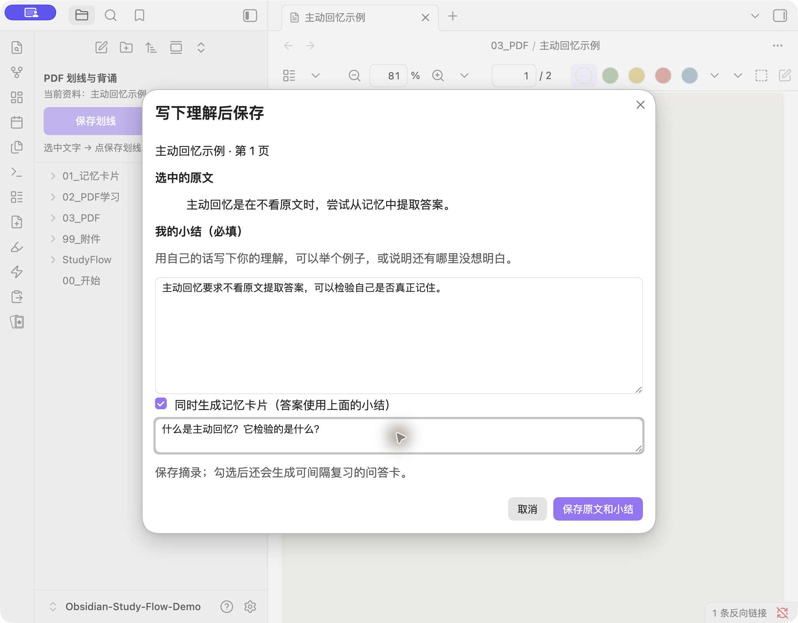
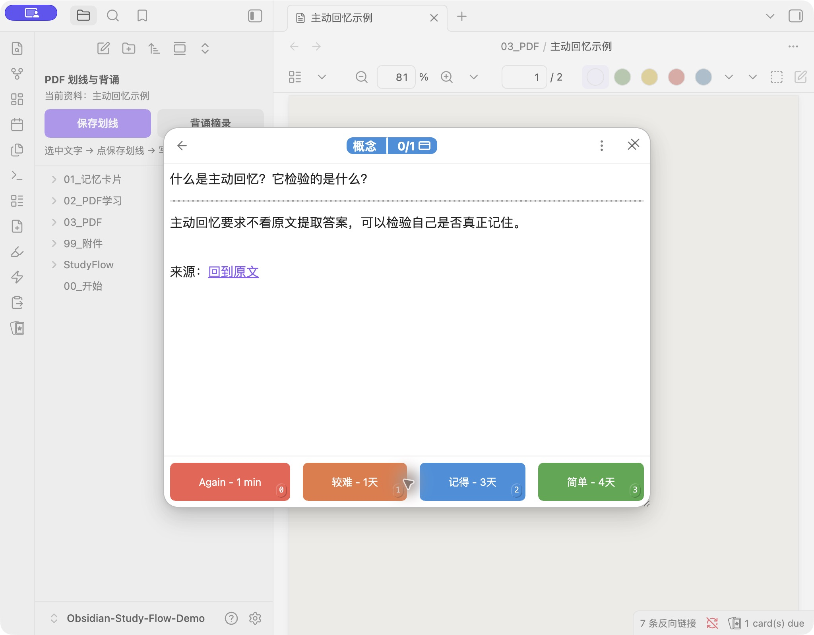

# Obsidian Study Flow

**截图、复制、PDF 选区 → 写下理解 → 记忆卡片 → 到期复习。**

[English](README.en.md) · [下载示例库](https://github.com/chrischen-coder/obsidian-study-flow/releases/latest) · [图文指南](docs/guide.md) · [接入已有库](docs/install.md)

Study Flow 将一套日常使用的学习流程开源：用 **QuickAdd** 执行建卡与保存，用 **PDF++** 获取 PDF 选区和回链，用 **Spaced Repetition** 安排复习。你得到可读的脚本、可改的配置和普通 Markdown 文件。适合错题、概念辨析、读书与课程学习。

## 先体验，再自定义

1. 在 [Releases](https://github.com/chrischen-coder/obsidian-study-flow/releases/latest) 下载 `obsidian-study-flow-starter-v0.1.0.zip`，解压。
2. 在 Obsidian 中选择「打开本地仓库」，打开解压后的 `Obsidian-Study-Flow` 文件夹。
3. 在「设置 → 第三方插件 → 浏览」安装并启用 **QuickAdd、PDF++、Spaced Repetition**，重启 Obsidian。ZIP 已含宏配置和脚本；不需要自己拼装宏。
4. 打开 `00_开始.md`，按说明建立第一张卡片，或打开原创示例 PDF 体验划线建卡。

完整的首次安装步骤见 [安装指南](docs/install.md)。建卡支持桌面版；手机可复习已同步的卡片。普通用户无需 Node、终端或 API Key。

## 可以做什么

| 输入 / 操作 | 入口 | 得到什么 |
| --- | --- | --- |
| 截图到剪贴板 | 截图变错题卡 | 图像作为问题，手写答案作为背面 |
| 复制文字 / 当前笔记选区 | 复制变错题卡 | 带入题目输入框，确认修改后生成卡片 |
| 手动输入问题 | 文字变错题卡 | 一问一答的 Markdown 卡片 |
| PDF 选中文字，写小结 | 保存划线 | 原文、页码、选区回链、小结进入学习卡 |
| 勾选「同时生成记忆卡片」 | 同一个保存窗口 | 另外生成问答卡，答案使用小结，附原文回链 |
| 暂停阅读 | 保存PDF阅读进度 | 保存页码；可获取时同时保存滚动位置，书架支持续读 |
| 查看理解 / 改卡组 | 背诵PDF摘录 / 修改当前卡片分类 | 打开学习笔记或调整复习标签 |
| 网页 / ChatGPT 选区（可选） | Web Clipper 模板 | 填好问题、答案后剪藏；不需要 AI 服务 |

PDF 学习卡记录阅读过程；记忆卡片用于测试回忆。不勾选建卡时，只保存摘录。勾选后必须填写一个问题，不能把整段原文直接当作“记住了”。

复习时先回答，再显示答案，最后诚实评分。调度日期由 Spaced Repetition 写入卡片。本项目不提供 OCR 或自动生成答案；扫描 PDF 须先有文字层。

## 为什么选择组合已有插件

| 组件 | 负责什么 | 上游 |
| --- | --- | --- |
| 本项目 | 流程、建卡脚本、选区保存窗口、目录配置、示例库 | MIT |
| QuickAdd | 宏、命令入口和输入交互 | [Christian Houmann](https://github.com/chhoumann/quickadd) |
| PDF++ | PDF 选区和定位链接 | [Ryota Ushio](https://github.com/RyotaUshio/obsidian-pdf-plus) |
| Spaced Repetition | 卡片解析、显示与复习调度 | [Stephen Mwangi 等贡献者](https://github.com/st3v3nmw/obsidian-spaced-repetition) |

感谢上游维护者。依赖代码由用户从社区插件市场安装，本仓库和 ZIP 不打包第三方插件。项目本身是 **QuickAdd 工作流套件**；安装路径是示例库或脚本导入，目前没有独立社区插件条目。

## 配置、维护与参与

修改 `starter-vault/StudyFlow/config.json` 可定制卡片目录、附件目录、书架与分类。所有输出在当前库内，运行时自动创建目录。`StudyFlow/scripts` 是稳定的脚本引用路径。

- [图文操作与排障](docs/guide.md)
- [已有库安装、备份与恢复](docs/install.md)
- [架构、数据格式和依赖关系](docs/architecture.md)
- [兼容性与验证记录](docs/compatibility.md)
- [Web Clipper 可选模板](web-clipper/README.md)
- [贡献指南](CONTRIBUTING.md) · [MIT 许可证](LICENSE) · [第三方致谢](NOTICE)

欢迎 Issue、PR、翻译和真实使用反馈。自己的学习内容归你管理；开源包使用原创练习材料，未收录个人库内容或收费教材。
