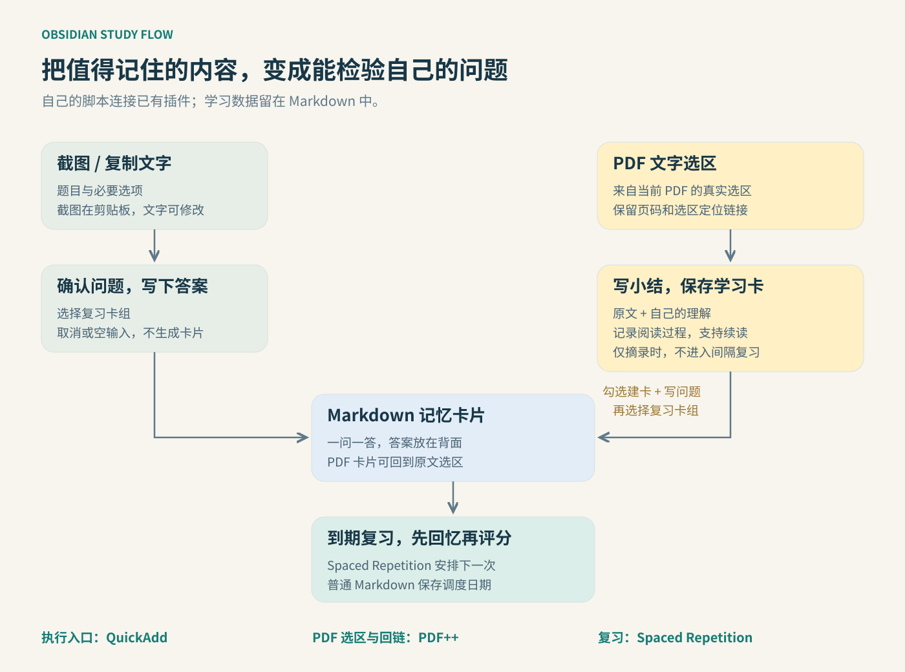

# 架构与数据约定



QuickAdd 是执行入口，脚本是本项目提供的流程层。截图读取 Electron 图像剪贴板；文字优先读当前 Markdown 选区，再读剪贴板，并让用户确认。PDF++ 提供当前 PDF 选区。脚本将信息写进库内 Markdown，Spaced Repetition 读取标签和问答语法并写复习调度。

## 两种数据分别负责什么

**PDF 学习卡**：一个 PDF 对应一篇笔记，用 `类型: PDF学习` 和 `PDF文件: "[[库内路径.pdf]]"` 查找。记录原文、小结、选区回链、当前页与续读链接。书架是这些学习卡的汇总，可重新生成。

**记忆卡片**：一张卡片一个问答，用独立的 `#flashcards/分类/子分类` 标签和单独一行 `?` 分隔。题目不会包含答案，PDF 来源在卡片背面。多段输入转为 `<br>`，避免空段落意外截断多行卡片。

```markdown
# 为什么熟悉不等于记住？

#flashcards/读书/要点

为什么熟悉不等于记住？
?
因为看见能认出，不代表脱离提示也能提取答案。
<br>
来源：[[03_PDF/主动回忆示例.pdf#page=1&selection=4,0,4,23|回到原文]]
```

SR 调度以插件的 `<!--SR:...-->` 格式保存在卡片中。本项目不计算下次日期，不改写调度算法。

## 保存顺序与去重

在保存前，先检查真实选区、非空小结、可选问题、卡组和 PDF 分类；取消任一必需输入，整个操作不写入。选区去重用 PDF 路径、页码、selection 参数；小结不同则追加。

摘录先落盘，然后按勾选状态创建问答卡。建卡失败会明确提示摘录已保留，可重试。同一来源 + 问题 + 答案生成 SHA-256 标记，扫描记忆卡片目录复用已有卡片。无需数据库。截图与纯文字卡使用时间戳和序号防止覆盖。

PDF 进度直接取当前视图。页码始终可用；内部滚动坐标不可用时退回页码链接，避免旧剪贴板内容造成误连。未加载出的总页数记为 0，不猜测。

## 模块

| 文件 | 作用 |
| --- | --- |
| `配置工具.js` | 每次读配置，检查库内路径与标签 |
| `错题卡工具.js` | 分类、建卡、目录创建、命名与来源去重 |
| `新建截图错题卡.js` / `新建文字错题卡.js` | 两种采集入口 |
| `修改当前卡片分类.js` | 更新卡组标签 |
| `PDF学习工具.js` | 学习卡、书架、续读信息 |
| `摘录PDF原文.js` | 真实选区、理解窗口、勾选建卡 |
| `打开PDF摘录.js` | 找对应 PDF 学习卡并打开摘录 |
| `保存PDF阅读进度.js` | 保存页码与可用的滚动位置 |
| `PDF学习按钮.js` | QuickAdd 启动宏，注册和清理左栏按钮 |

按钮使用 Obsidian Component 注册事件与清理回调，重跑启动宏先移除旧组件，避免按钮累加。点击按钮保留 PDF 选区，并阻止连续点击造成重入。

## 扩展与边界

路径、卡组和 PDF 分类由 JSON 配置；新的输入来源只需调用共享 `createCard`。PDF++ 的选区接口及 PDF 视图结构属于内部接口，未来升级可能变化，见 [兼容性记录](compatibility.md)。

修改配置不会自动移动旧文件；修改问题或答案会视作新卡片。对已有学习卡的手工修改，脚本保留正文，只更新约定章节。保留 Markdown、PDF 和附件即可继续使用或迁移你的学习数据。
