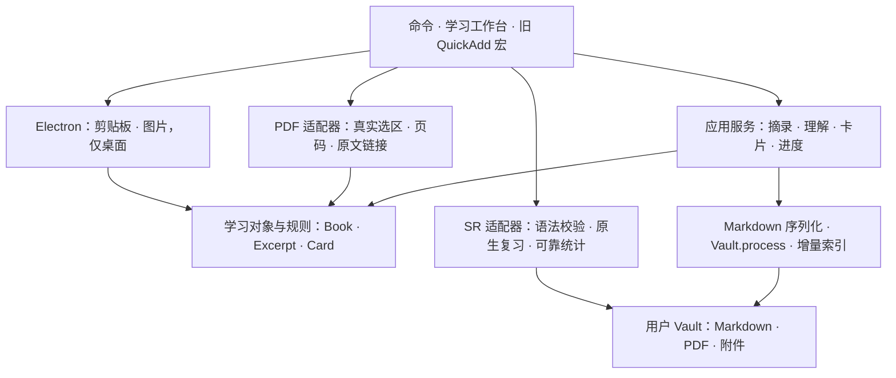

# Study Flow v0.2 架构 / Architecture

**PDF → 独立摘录 → 自己的理解 → 卡片草稿 → 发布 → SR 复习 → 原文。**

Markdown 是学习数据的来源，插件配置只负责目录和偏好，索引可重建。原生桌面插件使用 TypeScript 严格检查、esbuild 和 Obsidian 原生 ItemView / Modal / Setting；旧 QuickAdd 路径不变。旧实现说明保存在 [legacy-architecture.md](legacy-architecture.md)。

## 依赖与数据流 / Data flow



SR owns scheduling and its review interface. PDF++ supplies live selection coordinates. QuickAdd is optional. Study Flow orchestrates the learning flow and writes only local vault files.

| 模块 / Module | 职责与边界 / Responsibility |
| --- | --- |
| `src/main.ts` | 注册命令、视图、设置与 api.v1；接入事件、生命周期和通知 |
| `src/ui/workbench.ts` | 上手配置、阅读、收件箱、筛选、卡片列表和复习入口；不直接写文件 |
| `src/ui/editors.ts` | 理解、卡片预览与编辑、冲突比较、升级与恢复窗口 |
| `src/core/model.ts` | 领域类型、路径/配置校验、稳定 ID 和摘要规则；无 Obsidian / Electron 依赖 |
| `src/core/markdown.ts` | frontmatter、正文、管理边界、SR 格式和语义修订号 |
| `src/core/service.ts` | 保存协调、按对象串行、去重、原位卡片编辑、书架与关联修复 |
| `src/core/index.ts` | 启动索引、单文件增量刷新、外部编辑、订阅清理；数据来自 Markdown |
| `src/core/migration.ts` | 旧格式预览、全部文件预检、原文件备份、重复升级检查、恢复 |
| `src/core/progress.ts` | 按 PDF 路径保存快照，1.5 秒防抖、切换刷新、关闭清理 |
| `src/core/attachment.ts` | 图片延迟写入、失败清理、已引用附件保护 |
| `src/adapters/vault.ts` | 官方 Vault API、目录创建与可恢复的删除 |
| `src/adapters/pdf.ts` | PDF++ 内部选区接口与 PDF.js 视图事件，集中隔离并校验文件身份 |
| `src/adapters/review.ts` | SR 配置读取、受支持语法检查、同步、原生命令与统计范围 |
| `src/adapters/dependencies.ts` | 隔离第三方插件注册表与命令执行内部访问 |
| `starter-vault/StudyFlow/scripts/` | 启用原生插件时转接 api.v1，未启用时保留原逻辑 |

## 数据约定 / Markdown schema

所有对象使用 `study_flow_schema: 1`、`study_flow_kind`、`study_flow_id`。插件版本是 0.2.0，文件 schema 版本独立管理。ID 是 UUID；升级的旧对象使用基于来源的稳定摘要 ID。文件名含可读标题或日期与短 ID，编辑问题不会改名。

| 对象 | 内容 | 默认位置 |
| --- | --- | --- |
| Book | PDF 路径、分类、页码、总页数、阅读状态、最近阅读时间 | `02_PDF学习/{分类}/`，每本 PDF 一篇总览 |
| Excerpt | 书本 ID、PDF 与书本链接、页码、选区、原文快照、理解、整理状态、来源摘要 | `02_PDF学习/摘录/`，每条一个文件 |
| Card | 摘录/书本 ID、草稿或发布状态、问题、答案、卡组、来源、分隔符、调度注释 | `01_记忆卡片/`，每张一个文件 |
| Settings | schemaVersion、目录、默认分类/卡组、语言、自动进度、上手状态 | `.obsidian/plugins/study-flow/data.json` |

Book 保留旧属性名 `类型`、`PDF文件`、`分类`、`当前页`、`总页数`、`续读链接`，方便旧工具和手工编辑。Excerpt 有自己的快照，即使 PDF 被移除也能查看。路径属性使用 Obsidian 链接；关联以稳定 ID 为主。

管理正文使用 `<!-- study-flow:content:start -->` 与 `<!-- study-flow:content:end -->`，外部自由笔记与未知 frontmatter 字段保留。理解与原文使用字段边界。文件被手工破坏时显示路径，停止受影响的编辑，保留原文件供修复。

## 卡片格式 / SR interoperability

草稿的问答放在 `study_flow_draft_question` / `study_flow_draft_answer`，正文只显示编辑说明，既没有复习标签也没有问答/挖空语法，文件夹卡组也不会识别草稿。

发布后的管理正文示例：

```markdown
<!-- study-flow:content:start -->
# 记忆卡片 / Memory card

#flashcards/读书/要点

如何检验自己是否理解了概念？
?
合上原文，独立解释并举例，再核对遗漏。
<br><!-- study-flow:source -->
来源 / Source: [[03_PDF/主动回忆示例.pdf#page=1&selection=4,0,5,23|回到原文 / Return to source]]
<br>
[[02_PDF学习/摘录/示例-p1-1234abcd.md|摘录与理解 / Excerpt and understanding]]
<!--SR:!2026-10-08,3,250-->

<!-- study-flow:content:end -->
```

多段内容编码成 `<br>`，单独的分隔符行与 `::` / `==` 会转义，避免一张问答被意外拆开。来源只位于背面，文件标题不会使用答案。

**SR 1.15.4 会跳过独立 HTML 注释行，并用解析后的问题全文回写调度。** 因此卡片内部不插入独立问答边界注释，而使用外层管理区和嵌入正文的来源分隔标记。官方解析器测试验证生成的正文能识别、匹配原文、写入调度，再由 Study Flow 重新读写。

保存卡片时，在 `Vault.process()` 内重新读取最新卡片，并原样合并全部该卡片的 `<!--SR:...-->` 参数，不猜测 SM-2 / FSRS 内容。UI 修订号排除调度、更新时刻与文件路径；只有内容变化才触发冲突。已发布卡片不能降回草稿，以免移走已有调度。

Adapter supports default forward multiline cards, custom multiline question/answer separators and folder decks. Unsupported custom inline syntax, end markers, custom cloze patterns, fenced code or non-NOTES storage fail closed for publication while drafts remain available. Third-party settings are never automatically changed.

## 保存、去重与冲突 / Save semantics

1. 按钮触发时立即取得选区快照，校验 PDF 身份、页码与 selection 参数；不读旧剪贴板。
2. 查找或创建书本，摘录摘要使用书本 ID、页码、坐标和原文。重复返回已有对象，内容修订允许新快照。
3. 按对象/来源串行；已有文件在 `Vault.process()` 中校验 ID 与语义修订号。UI 内容冲突保留输入，展示新旧内容供选择。
4. 后台进度只在 process 回调内修改页码、总页数和阅读时间，保留同时到来的分类、状态或自由笔记修改。
5. 主文件成功后再更新索引与书架。次要刷新失败返回“已保存”与提示，可重建索引并重试书架。
6. 截图取消不落盘；保存时创建新附件，卡片失败清理本次未引用的图片，成功后保留引用。

Save operations return `{ status: 'created' | 'updated' | 'unchanged', id, path, warnings }`. User cancellation or unfinished onboarding may return `null`. View-opening methods return no save result.

## 进度与文件事件 / Progress and lifecycle

对每个 PDF 维护快照与防抖定时器；仅观察当前阅读视图，避免同一本 PDF 的非活动标签页覆盖进度。页面/视区事件有可移除订阅，接口不可用时用轻量轮询补充。PDF 切换时刷新对应快照；未开始的 PDF 不创建文件。

原文定位优先使用真实 selection 链接，不能定位时回页码；PDF 缺失时显示摘录快照。PDF 重命名修复来源，学习文件移动修复关联。后台保存不会自动标记“读完”。

ItemView subscribes to index changes and releases subscriptions/timers on close. Plugin events and intervals use Obsidian registration cleanup; PDF bus subscriptions are removed explicitly. Configuration inputs are not destroyed by background index updates. Unload flushes queued progress as a best effort, then releases index listeners. Each new plugin instance rebuilds state from Markdown.

## 旧数据升级 / Legacy migration

先识别和展示旧文件，预览不写入。执行前预检全部目标；先备份原文件和恢复 manifest，再给书本与卡片增加 ID，提取可明确识别的旧 PDF 摘录。含糊格式跳过并列出路径。旧书本保留原正文与摘录，新摘录记录来源；旧卡片保留题目、答案和调度。

重复升级检查身份和目标文件。恢复前验证全部已生成或未写入的文件；升级后发生新编辑或复习时停止恢复。备份路径只接受本项目库内目录，删除新建摘录使用 Vault 的可恢复删除。原 JSON 不覆盖，原生导入配置独立保存。

## 固定入口 / Public API

插件 ID：`study-flow`。主要命令 ID：

`open-workbench` · `capture-pdf` · `capture-text` · `capture-screenshot` · `save-progress` · `start-review`

另外提供 `open-workbench-tab`、`upgrade-legacy`、`restore-upgrade` 和 `rebuild-index`。可以从 Obsidian 快捷键设置为常用命令分配按键。

```javascript
const api = app.plugins.plugins['study-flow']?.api?.v1;
await api.captureText({ 题目: '问题', 答案: '答案', 分类: '考试/数据库' });
// 仍由原生编辑窗口确认保存/发布；参数不会跳过用户确认。
```

`api.v1` methods: `openWorkbench`, `capturePdf`, `captureText`, `captureScreenshot`, `saveProgress`, `openExcerpts`, `createStudyNote`, `changeDeck`. Captures and deck edits preserve legacy question/answer/category variables. Save failures propagate rather than falling through to a duplicate legacy write.

## 构建与验证 / Build and verification

Node 20+ → `npm ci` → `npm run check` → `npm test` → `npm run package`。esbuild 外置 `obsidian` 与 `electron`；插件只需 main.js、manifest.json、styles.css。依赖代码仅在开发测试使用，不随安装包分发。

CI 在 Windows、macOS、Linux 运行严格检查、测试和三包打包，上传校验文件。示例包只读取原创 PDF、公开欢迎页、必要配置和本插件文件；不会扫描或打包个人库、第三方二进制、工作区状态、私有插件配置。

索引启动扫描候选文件，之后只读改动的单个 Markdown；筛选在内存中执行，列表每次最多显示 100 条。1,000 条样例的测试检查单条更新只读一个文件，不等同于真实应用压力测试。详见 [validation-v0.2.md](validation-v0.2.md)。

## 本次编码交付与后续 / Implementation and next versions

v0.2 已实现插件基础、模型与存储、PDF 摘录/进度、工作台与收件箱、SR 与旧宏转接、独立打包和双语教程。按功能分支提交 PR，正式 Release 与社区上架在验收后推进。

后续独立迭代：OCR、AI 辅助制卡、图像遮挡、更多 SR 语法/存储适配、移动端采集、真实 Windows/Linux 应用验收。先验证现有闭环，再扩展新的输入与卡片类型。

官方接口参考：[Obsidian ItemView](https://github.com/obsidianmd/obsidian-developer-docs/blob/main/en/Plugins/User%20interface/Views.md)、[Vault.process](https://docs.obsidian.md/Plugins/Vault)、[PDF++](https://ryotaushio.github.io/obsidian-pdf-plus/)、[SR 原生复习](https://stephenmwangi.com/obsidian-spaced-repetition/flashcards/reviewing/)。
