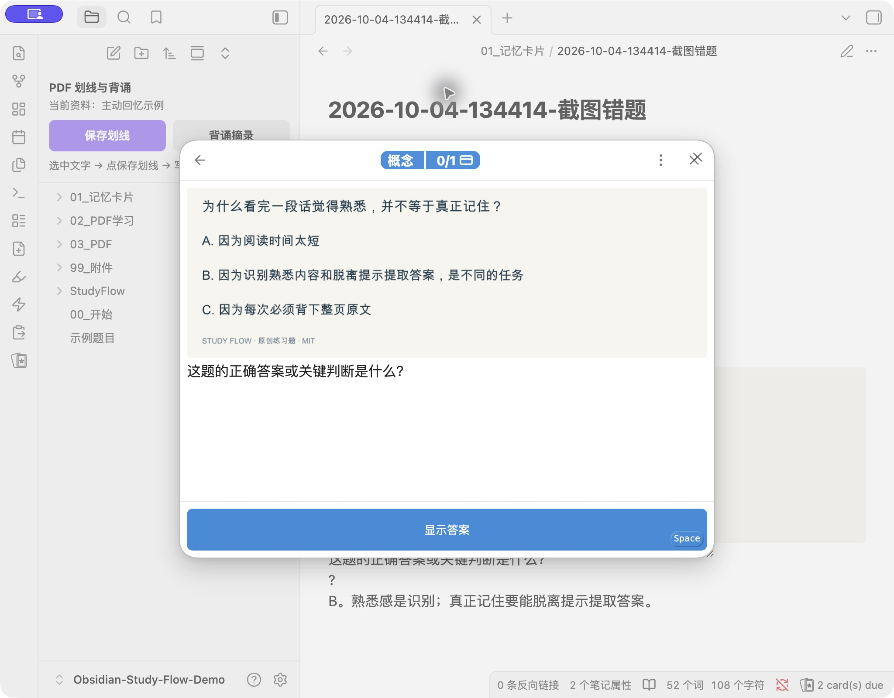
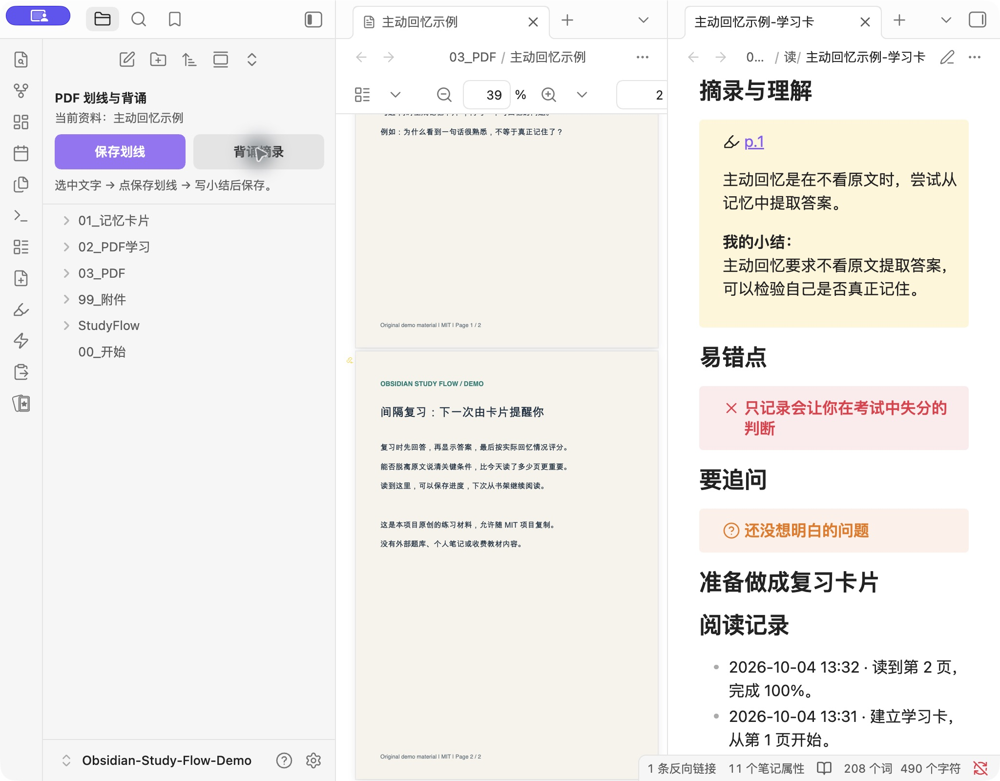

# 从收集到记住：图文指南

先完成 [安装](install.md)。所有步骤的命令都可从 `Cmd+P` / `Ctrl+P` 搜索；入口名称前有 `QuickAdd:`。

## 截图变错题

1. 把题干和必要选项截图到**剪贴板**。macOS：`Ctrl+Cmd+Shift+4`；Windows：`Win+Shift+S`；Linux：用能复制图像的截图工具。
2. 运行「截图变错题卡」，选卡组，填写答案。
3. 图像保存在本地附件目录，Markdown 卡片保存在记忆卡片目录。截图作为正面，答案作为背面。标题不会显示答案。

先截题目，答案写在输入框里。如果截图本身包含答案，复习正面也会看到答案。

## 复制 / 文字变错题

1. 从网页、PDF 或其他应用复制文字，运行「复制变错题卡」。当前 Markdown 选区优先于剪贴板。
2. 在题目输入框确认文字，必要时改成一个真正能检验记忆的问题。
3. 选卡组、写答案后保存。手动输入也可用「文字变错题卡」；两个入口使用同一逻辑。

复制只是带入输入框；取消或空题目、空答案都不会生成文件。

## 阅读 PDF，勾选生成记忆卡片

1. 打开库内 PDF，拖动选中一小段文字。首次可用 `03_PDF/主动回忆示例.pdf`。
2. 点左侧「保存划线」。窗口展示刚才的原文，填写自己的小结。
3. 想记住这段知识时勾选「同时生成记忆卡片」，补充问题；小结就是卡片答案。
4. 点击保存后选卡组；PDF 尚无学习卡时，再选一个 PDF 分类。

不勾选时只保存学习笔记；勾选后额外生成一张问答卡。原文与小结不会写入 PDF 文件，选区回链让 PDF++ 显示对应高亮。

同一 PDF 选区再次保存时，相同小结会跳过，新小结会追加；相同来源、问题和答案的记忆卡片也会复用。改变问题或答案会产生另一张卡片，这是一次新的自测目标。

「背诵摘录」打开对应学习笔记，供你练习复述。它不会自动安排到期时间；问答卡的到期复习由 Spaced Repetition 完成。

## 暂停、续读与复习

暂停前点回 PDF，运行「保存PDF阅读进度」。当前页码被记录；可读取滚动位置时一并保存，否则仍可回到这一页。新文件首次尚未完全加载时，总页数可能暂为 0，加载完成后再保存进度会更新。

从 PDF 学习卡或书架的「从第 N 页继续」链接回来。页码指 PDF 的物理页序，可能与书中印刷页码不同。百分比表示读到哪一页，并不代表知识掌握程度。

复习时运行 Spaced Repetition 的复习卡片命令：先答，再显示答案，按真实情况选 Again / 较难 / 记得 / 简单。按钮上的间隔由插件计算。

## 常见问题

| 现象 | 检查与处理 |
| --- | --- |
| 找不到 QuickAdd 入口 | 确认插件已启用，复制了隐藏配置目录，重启后再搜完整命令名 |
| 左侧没有 PDF 按钮 | 显示文件列表；重启，或从 QuickAdd 菜单运行「PDF学习按钮」 |
| 提示剪贴板没有图片 | 截图要复制到剪贴板；仅保存图片文件不够 |
| PDF 没有选区 | 拖动文字选区；图片 / 扫描件需先 OCR；矩形图片选区不支持这条摘录入口 |
| 卡片没进入复习 | 检查 SR 的标签含 `#flashcards`、多行分隔符为 `?`，重新打开复习命令 |
| 安装到已有库时卡片显示标题 | 可在 SR 设置关闭「显示卡片上下文」；截图标题本身不含答案 |
| 摘录保存但建卡失败 | 摘录仍在学习卡里；修正配置后对相同选区重试，重复内容会去重 |
| 移动 PDF 后回链失效 | 保持 Obsidian「自动更新内部链接」开启，优先在 Obsidian 内移动文件 |
| 手机运行脚本失败 | 当前建卡依赖桌面 Electron / 本地模块；手机用于复习已同步的卡片 |

没有 AI、账号或付费接口是运行前提。每张卡片的题目与答案由你确认。
