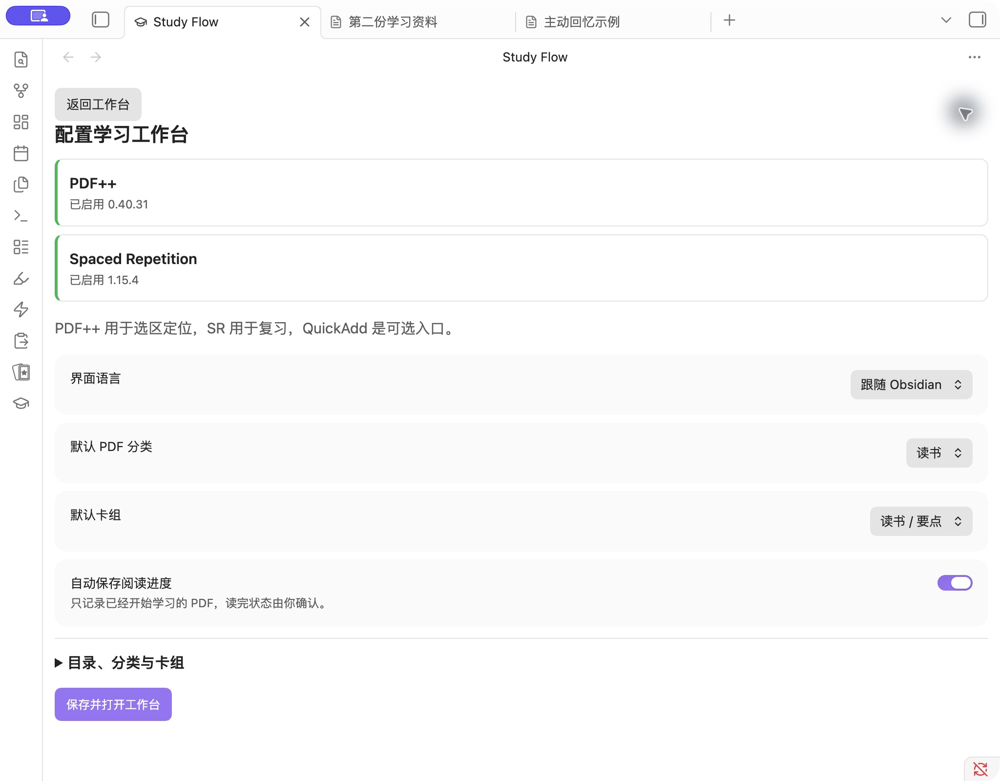
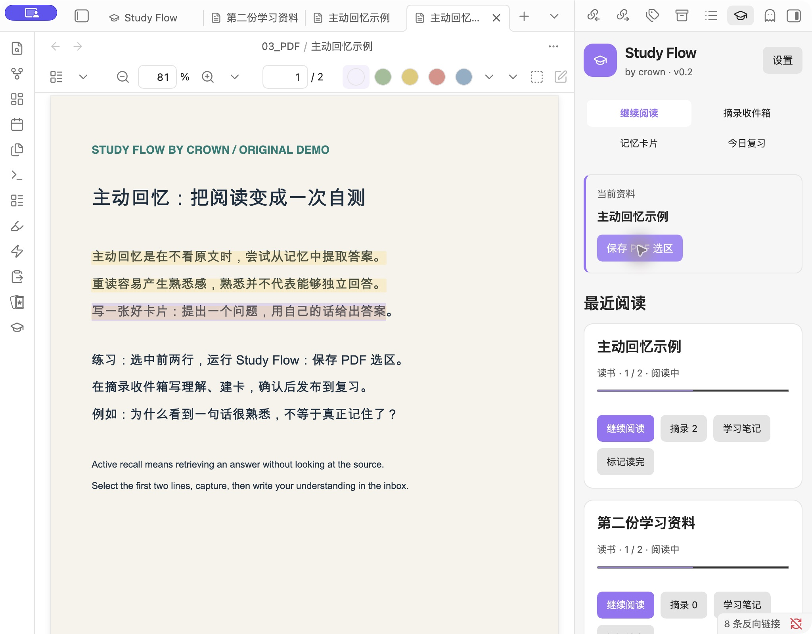
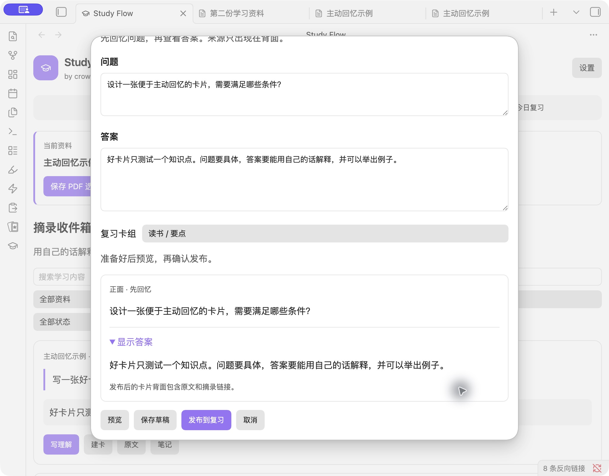
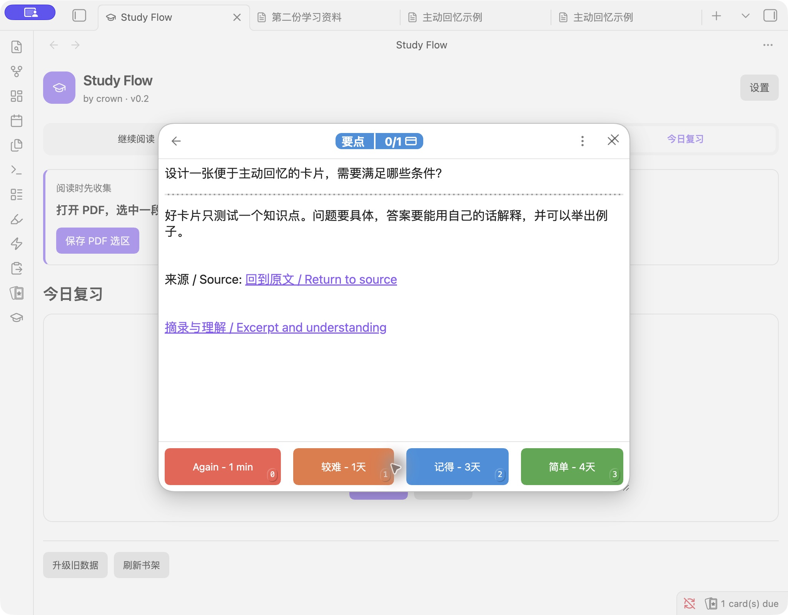

# Study Flow v0.2 native plugin guide

[中文](native-guide.md) · [Home](../README.en.md) · [Legacy QuickAdd guide](guide.md)

## Install without Node or QuickAdd

v0.2 is a desktop plugin preview, delivered through a feature PR. It has no formal release or community listing yet. Get its packages from the PR’s passing [Actions build artifacts](https://github.com/crown-sports/obsidian-study-flow/actions). Sign in to GitHub, open the matching run and download a platform artifact. It contains three ZIPs and `SHA256SUMS`.

| Package | Purpose |
| --- | --- |
| `obsidian-study-flow-plugin-v0.2.0.zip` | Native plugin for an existing vault |
| `obsidian-study-flow-example-v0.2.0.zip` | Separate practice vault with our plugin and original PDF |
| `obsidian-study-flow-starter-v0.2.0.zip` | Legacy QuickAdd macros and examples, without the native plugin |

For an existing vault, copy the extracted `study-flow` folder into `.obsidian/plugins/`, restart Obsidian and enable **Study Flow** in Community Plugins. For the example, open the extracted `Study-Flow-Example` folder as a new vault, then enable Study Flow.

Install and enable **PDF++** and **Spaced Repetition** from the community browser. The workbench offers their install links and reports enabled versions. Study Flow does not change their settings.

## 1. Save the defaults

Open the 🎓 ribbon icon or **Study Flow: Open learning workbench**. Use **Open learning workbench in a tab** for more space.

Choose language, default PDF category and deck. Expand **Folders, categories and decks** to change output paths or preview an import of `StudyFlow/config.json`. Defaults are `02_PDF学习/摘录`, `01_记忆卡片` and `99_附件`. Folder changes affect new files.

## 2. Capture while reading

Add a text-based PDF to your vault. Select a passage and run **Study Flow: Capture PDF selection**, or click that button with the workbench open in the sidebar. It snapshots the live selection immediately and saves it without requiring a reflection. Your reading position stays open.

The same book, page, selection and source text reuse the existing excerpt. Changed source text gets a new snapshot. Each excerpt is its own Markdown file with source selection, page, study note link and source snapshot.

## 3. Understand, draft, preview and publish

Filter the **Inbox** by book, category, status or text. Write an explanation in your own words, give an example or record a question. Make several cards from one excerpt when useful.

Keep a card focused on one point. Empty questions or answers cannot be published. **Save draft** stores the question and answer in frontmatter and leaves no SR card syntax in the body, so drafts stay outside review.

Preview the question, reveal the answer, choose a deck and publish. Publishing generates the SR-compatible card body.

## 4. Review and return to the source

**Review** opens SR’s native review interface, including new and due cards. Counts cover **all SR decks**, including cards created elsewhere. Unknown or unready data is not presented as a count.

Recall first, reveal, then rate. The back contains PDF and excerpt links, also usable directly from Markdown. Page links provide a fallback when precise selection is unavailable; if the PDF is missing, the excerpt snapshot remains readable.

Edit reviewed cards through **Edit and preview**. Questions, answers and decks can change while file paths, stable IDs and existing SM-2 / FSRS scheduling comments are preserved. You decide whether changed learning content needs relearning; Study Flow does not calculate schedules.

## Progress, clipboard and screenshots

Progress starts after capturing an excerpt or manually saving a PDF’s progress. Page changes save after 1.5 seconds and flush when switching. Use **Save PDF reading progress** at any time. Unstarted PDFs create no learning files, and reaching the final page does not mark a book finished.

Clipboard capture uses the active Markdown selection first, then the desktop clipboard. Cancel creates no files. Screenshot capture previews a clipboard image and writes the PNG only when saving. A failed card write cleans up the newly created, unreferenced image; images referenced by saved drafts remain.

## Legacy upgrade and recovery

Legacy learning files appear with links to their originals. **Upgrade legacy data** previews books, excerpts, cards and skipped items. **Back up and upgrade** saves originals in `StudyFlow/upgrade-backups/` before applying changes.

Books retain their contents, extracted excerpts get separate files with legacy provenance, and cards gain IDs while retaining answers and SR scheduling. Repeating the upgrade is safe.

**Restore an upgrade backup** preflights every file. It stops if later edits or reviews would be overwritten. A partially applied upgrade can also be restored. Keep backup folders intact.

QuickAdd paths under `StudyFlow/scripts/` remain stable. Enabled native plugins receive calls through `api.v1`, including question, answer and category variables. Disabled native plugins leave the legacy flow available. Imported native settings are managed separately; the old JSON remains for legacy scripts.

## Editing and troubleshooting

- Keep `study_flow_*` properties and managed boundaries when editing understanding or card text. Freeform notes outside the managed area remain intact.
- Concurrent content edits preserve your UI input and show the latest file for comparison. Scheduling-only SR updates merge automatically; choose explicitly when content conflicts.
- PDF renames repair source links. Study note and excerpt moves retain identity and repair associations. Copied learning objects must not keep duplicate IDs.
- Missing PDFs do not remove source snapshots. Use the book’s **Relink PDF** button to choose a vault PDF and repair source links, or edit its `PDF文件` property.
- If a secondary library refresh fails, the primary file is already saved. Retry **Refresh library**. Malformed learning files show their paths for repair and index rebuilding.
- Missing or incompatible PDF++ / SR interfaces preserve your files and offer recovery links. You can save drafts without SR.

## Compatibility and development

Local desktop processing; no network calls, OCR, AI or generated answers. Scanned PDFs need a text layer. Synced Markdown and attachments can be reviewed with mobile SR; capture UI is desktop-only.

Real application validation: macOS, Obsidian 1.13.7, PDF++ 0.40.31 and SR 1.15.4. Windows/Linux build and file checks run in CI; their application UI is not yet validated. See [validation](validation-v0.2.md).

Default SR syntax, forward multiline cards, custom multiline question/answer separators and folder decks are covered. Custom inline separators, end markers, custom cloze patterns, fenced code blocks and non-NOTES scheduling storage are not supported for publication yet. The UI explains the limitation and keeps drafting available without changing SR settings.

Developers need Node 20+: `npm ci`, `npm run check`, `npm test`, `npm run package`. Packages go into `dist/`; installed plugins require no `node_modules`. See [architecture and API](architecture.md).
